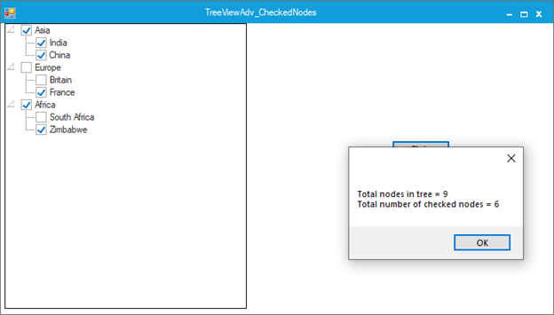

# How to count all checked nodes of WinForms TreeViewAdv?

You can get the count for all checked nodes in [WinForms TreeViewAdv](https://www.syncfusion.com/winforms-ui-controls/treeview) control by using [CheckedNodes](https://help.syncfusion.com/cr/windowsforms/Syncfusion.Windows.Forms.Tools.TreeViewAdv.html#Syncfusion_Windows_Forms_Tools_TreeViewAdv_CheckedNodes) property. Refer the below code for your reference.

**C#**
```csharp
int checkedCount = treeView1.CheckedNodes.Count;
```

**VB.Net**
```csharp
Dim checkedCount As Integer = treeView1.CheckedNodes.Count
```


Take a moment to peruse the [WinForms TreeViewAdv - CheckBox](https://help.syncfusion.com/windowsforms/treeview/getting-started#checkbox) documentation, to learn more about checkbox with examples.
